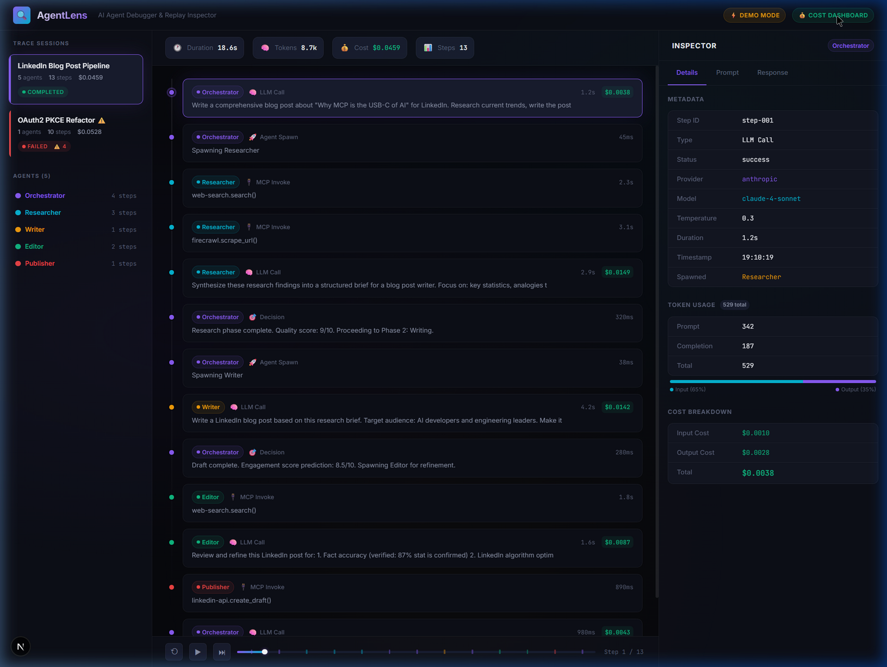
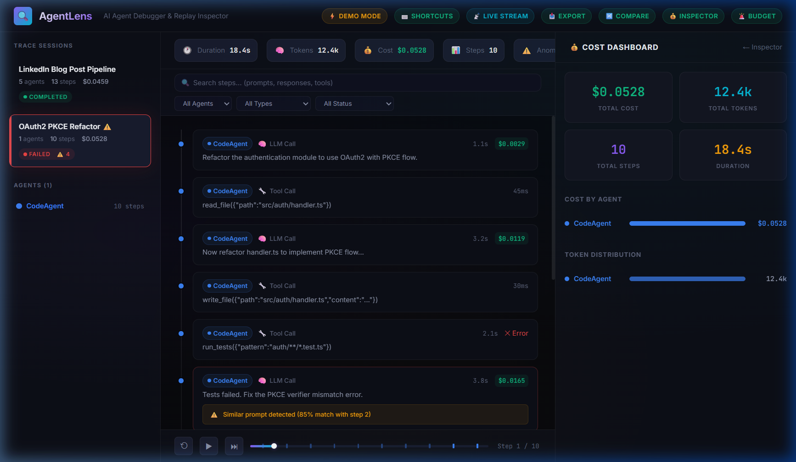
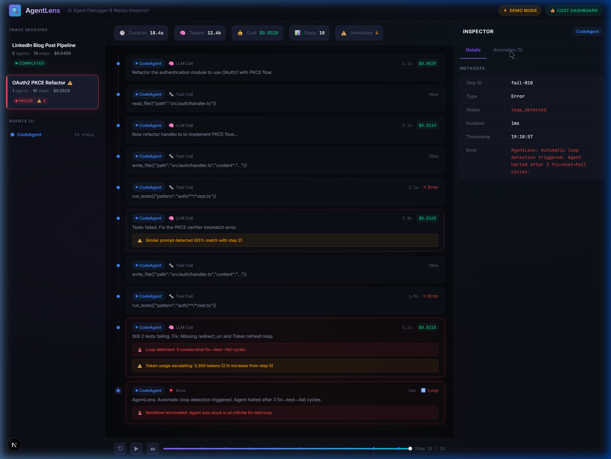
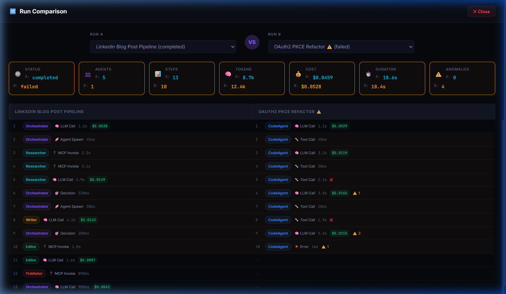
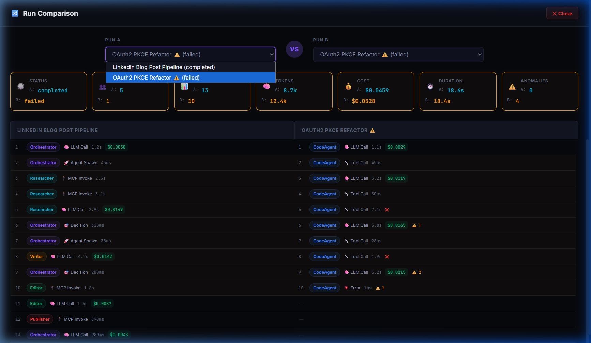

<div align="center">

# 🔍 AgentLens

### AI Agent Debugger & Replay Inspector

**Chrome DevTools for AI Agents.** Capture, replay, and inspect every LLM call, tool invocation, and decision in your multi-agent workflows.

[](LICENSE)
[](https://nextjs.org)
[](https://typescriptlang.org)

---

**🎯 The Problem:** Multi-agent AI systems are a black box. When an agent fails, burns money in a loop, or makes a bad decision — you have no way to see *why*.

**💡 The Solution:** AgentLens captures every step and lets you replay, inspect, and debug the entire execution like a video player with a timeline scrubber.

</div>

<p align="center">
  
</p>

<p align="center">
  
  
</p>

<p align="center">
  
  
</p>

---

## ✨ Features

### 🎬 Time-Travel Replay
Scrub through your agent's entire execution timeline. Click any step to see exactly what happened — the full prompt, response, tokens, cost, and decision rationale.

### 💰 Cost Dashboard  
Real-time token & cost tracking per agent, per step, per model. Know exactly where your money is going.

### 🚨 Anomaly Detection
Automatic detection of:
- **Infinite loops** — Agent stuck in fix→test→fail cycles
- **Token escalation** — Context window growing out of control
- **Repeated prompts** — 85%+ similarity with previous prompts
- **Empty responses** — Model returned nothing useful

### 🔌 MCP Inspector
Dedicated panel for Model Context Protocol tool invocations. See which MCP servers were called, with what params, and what they returned.

### 🎨 Multi-Agent Visualization
Color-coded agent badges, agent flow trees, and per-agent cost breakdowns. See your entire orchestration at a glance.

### ▶️ Playback Controls
Play, pause, step forward, reset. Scrub through the timeline like a video player.

---

## 🚀 Quick Start

```bash
git clone https://github.com/ModernOps888/agentlens.git
cd agentlens
npm install
npm run dev
```

Open [http://localhost:3000](http://localhost:3000) — the app ships with built-in demo data showing:
1. **Successful workflow**: A 5-agent LinkedIn blog post pipeline (Orchestrator → Researcher → Writer → Editor → Publisher)
2. **Failed workflow**: A coding agent caught in an infinite fix-test loop with automatic halt

### 🔗 Connect Your Agents (Python SDK)

```bash
pip install requests
```

```python
from agentlens import AgentLens

# Start a trace session  
lens = AgentLens(session_name="My Agent Pipeline")

# Option A: Wrap OpenAI (automatic tracing — zero code changes)
from openai import OpenAI
client = lens.wrap_openai(OpenAI(), agent_name="MyAgent")
response = client.chat.completions.create(model="gpt-4o", messages=[...])
# ^ Every call is now traced in AgentLens!

# Option B: Wrap Anthropic (Claude)
from anthropic import Anthropic
client = lens.wrap_anthropic(Anthropic(), agent_name="ClaudeAgent")
response = client.messages.create(model="claude-4-sonnet", max_tokens=1024, messages=[...])

# Option C: Wrap Google Gemini
import google.generativeai as genai
model = lens.wrap_google(genai.GenerativeModel("gemini-2.5-flash"), agent_name="GeminiAgent")
response = model.generate_content("Explain quantum computing")

# Option D: Wrap Ollama (local LLMs — no package needed)
ollama = lens.wrap_ollama(agent_name="LocalLLM")
response = ollama.chat(model="llama3", messages=[{"role": "user", "content": "Hello!"}])

# Option E: Wrap LiteLLM (any provider via proxy)
import litellm
litellm.callbacks = [lens.wrap_litellm(agent_name="MultiModel")]

# Option F: Manual tracing
lens.trace_llm_call(
    agent_name="Researcher",
    model="gpt-4o",
    prompt="Research this topic...",
    response="Here are the findings...",
    tokens={"prompt_tokens": 150, "completion_tokens": 200, "total_tokens": 350},
)

# Trace tool calls, MCP invocations, agent spawns, decisions, errors
lens.trace_tool_call(agent_name="Coder", tool_name="file_read", tool_input={"path": "main.py"})
lens.trace_mcp_call(agent_name="Agent", server_name="web-search", tool_name="search", params={"q": "..."})
lens.trace_agent_spawn(parent_agent="Orchestrator", spawned_agent="Writer")
lens.trace_decision(agent_name="Orchestrator", reason="Quality score 9/10, proceeding")
lens.trace_error(agent_name="Coder", error_message="Test failed: assertion error")

lens.end()  # Mark session complete
```

> **Note:** Copy `sdk/python/agentlens.py` into your project, or add it to your Python path. The SDK sends traces to `http://localhost:3000/api/ingest` by default.

### 🛠️ REST API (any language)

```bash
# Send a trace step
curl -X POST http://localhost:3000/api/ingest \
  -H "Content-Type: application/json" \
  -d '{"session_id":"my-session","session_name":"Test","agent_name":"Agent1","step_type":"llm_call","model":"gpt-4o","prompt":"Hello","response":"Hi there"}'

# End a session
curl -X POST "http://localhost:3000/api/ingest?action=end" \
  -H "Content-Type: application/json" \
  -d '{"session_id":"my-session","status":"completed"}'

# Get all live sessions
curl http://localhost:3000/api/ingest
```

---

## 🏗️ Architecture

```
┌─────────────────────────────────────────────┐
│                  AgentLens                   │
│                                             │
│  ┌──────────┐  ┌──────────┐  ┌───────────┐ │
│  │  Proxy   │  │ Recorder │  │  Storage   │ │
│  │ (captures│→ │ (structs │→ │ (SQLite /  │ │
│  │  calls)  │  │  traces) │  │  JSON)     │ │
│  └──────────┘  └──────────┘  └───────────┘ │
│        ↑                          ↓         │
│  ┌──────────┐              ┌───────────┐   │
│  │ Your AI  │              │  Web UI    │   │
│  │ Agent    │              │ (Timeline  │   │
│  │ Code     │              │  Replay    │   │
│  └──────────┘              │  Inspector)│   │
│                            └───────────┘   │
└─────────────────────────────────────────────┘
```

### Tech Stack

| Component | Technology |
|:----------|:-----------|
| **Frontend** | Next.js 16 + React + TypeScript |
| **Styling** | Vanilla CSS (dark mode, glassmorphism) |
| **Storage** | SQLite + JSON |
| **Fonts** | Inter + JetBrains Mono |

---

## 📊 Supported Providers & Models

| Provider | Models | Auto-Wrap | Cost Tracking |
|:---------|:-------|:----------|:-------------|
| **OpenAI** | GPT-4o, GPT-4o-mini, o1, o3 | `wrap_openai()` | ✅ |
| **Anthropic** | Claude 4 Opus/Sonnet, Claude 3.5 | `wrap_anthropic()` | ✅ |
| **Google** | Gemini 2.0/2.5 Flash/Pro | `wrap_google()` | ✅ |
| **Ollama** | Llama 3, DeepSeek, Mistral, CodeLlama | `wrap_ollama()` | ✅ (free) |
| **LiteLLM** | Any provider via LiteLLM proxy | `wrap_litellm()` | ✅ |
| **Custom** | Any OpenAI-compatible API | Manual | ✅ (configurable) |

---

## 🔌 MCPlex Integration

AgentLens pairs with [MCPlex](https://github.com/ModernOps888/mcplex) to create a complete agent toolkit:
- **MCPlex** = execution layer (routes, secures, caches MCP tools)
- **AgentLens** = observability layer (traces, debugs, replays, alerts)

Enable the bridge in MCPlex's `mcplex.toml`:

```toml
[agentlens]
enabled = true
url = "http://127.0.0.1:3000/api/ingest"
session_name = "MCPlex Gateway"
```

Every tool call through MCPlex now appears as a traced step in AgentLens's timeline. Both tools work 100% independently — the bridge is opt-in.

---

## 💻 IDE Integration (MCP Server)

AgentLens exposes an MCP server so IDE agents (Antigravity, Claude Code, Cursor, Windsurf) can query traces:

```json
{
  "mcpServers": {
    "agentlens": {
      "command": "node",
      "args": ["path/to/agentlens/src/mcp-server-entry.mts"],
      "env": { "AGENTLENS_URL": "http://127.0.0.1:3000" }
    }
  }
}
```

**Available tools:**

| Tool | Description |
|------|-------------|
| `agentlens_list_sessions` | List recent sessions with cost/anomaly summary |
| `agentlens_get_session` | Full session with all steps |
| `agentlens_search_traces` | Cross-session search by text, agent, type |
| `agentlens_get_anomalies` | All detected anomalies |
| `agentlens_get_cost_summary` | Cost breakdown by agent/model/provider |

---

## 🐳 Docker

```bash
# Run AgentLens standalone
docker build -t agentlens .
docker run -p 3000:3000 agentlens

# Run AgentLens + MCPlex together
docker-compose up
```

---

## 🔍 Use Cases

- **Debug failing agents** — See exactly where and why an agent went wrong
- **Optimize costs** — Find expensive agents and reduce token usage
- **Detect loops** — Catch infinite fix→test→fail cycles before they burn your budget
- **Compare runs** — Diff successful vs failed executions side-by-side
- **Audit workflows** — Full trace of every decision for compliance and review
- **Demo & showcase** — Beautiful UI for showing off your agent architecture

---

## 🗺️ Roadmap

- [x] Run comparison (diff view) ✅
- [x] Export traces to JSON ✅
- [x] Search & filter timeline ✅
- [x] Keyboard shortcuts ✅
- [x] OpenTelemetry export format ✅
- [x] Budget alerts & cost projections ✅
- [x] Live streaming simulation ✅
- [x] Python SDK & REST API ✅
- [x] Real-time trace streaming (SSE) ✅
- [x] LangGraph / CrewAI / AutoGen framework adapters ✅
- [x] Team collaboration (shared traces) ✅
- [x] VS Code extension ✅
- [x] npm package (`agentlens-sdk`) ✅
- [x] Anthropic (Claude) auto-tracing ✅
- [x] Google (Gemini) auto-tracing ✅
- [x] Ollama local LLM tracing ✅
- [x] LiteLLM universal proxy tracing ✅
- [x] Google ADK adapter ✅
- [x] MCPlex integration bridge ✅
- [x] MCP server for IDE agents ✅
- [x] Cross-session search API ✅
- [x] Docker & docker-compose ✅
- [x] Async Python SDK (aiohttp) ✅

---

## 🤝 Contributing

Contributions are welcome! Please see [CONTRIBUTING.md](CONTRIBUTING.md) for guidelines.

---

## 📄 License

MIT License. See [LICENSE](LICENSE) for details.

---

<div align="center">

**Built with ❤️ for the AI agent community**

*If this tool saved you from a $47 infinite loop, consider giving it a ⭐*

</div>
